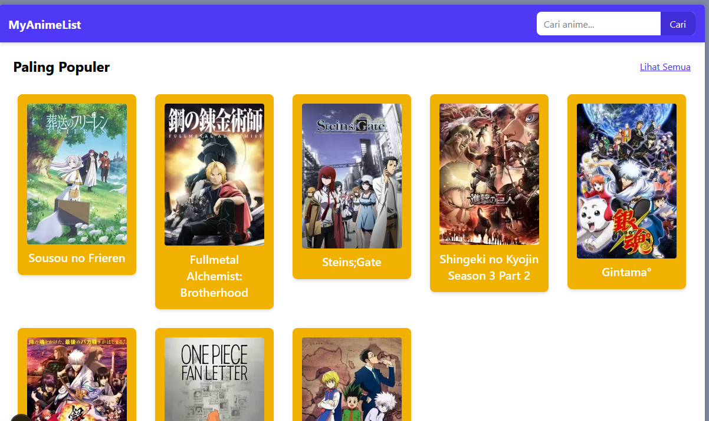

# 📺 MyAnimeList Clone (Next.js + Jikan API)

>    Project ini saya kembangkan untuk mendalami **Next.js 15+ (App Router)** sekaligus belajar memproses dan parsing data dari internet menggunakan **[Jikan API](https://jikan.moe/)**.


## ✨ Features

- 🔎 Cari anime populer menggunakan Jikan API  
- 📖 Detail halaman anime  
- 🎨 UI responsif dengan Tailwind CSS  
- ⚡ Data selalu fresh (no-store fetch)
- 🔐 GitHub Authentication with NextAuth.js
- 👤 User Dashboard with watchlist and favorites
- 📋 Dedicated watchlist and favorites pages
- 🎯 User profile management

## 🚀 Tech Stack

- [Next.js 13+](https://nextjs.org/) (App Router)
- [Tailwind CSS](https://tailwindcss.com/)
- [Jikan API](https://jikan.moe/)
- [NextAuth.js](https://next-auth.js.org/) for authentication

## 🔧 Setup Authentication

1. Create a GitHub OAuth App:
   - Go to GitHub Settings > Developer settings > OAuth Apps
   - Click "New OAuth App"
   - Set Homepage URL to `http://localhost:3000`
   - Set Authorization callback URL to `http://localhost:3000/api/auth/callback/github`
   - Copy the Client ID and Client Secret

2. Create a `.env.local` file in the root directory:
```env
GITHUB_ID=your_github_oauth_app_client_id
GITHUB_SECRET=your_github_oauth_app_client_secret
AUTH_SECRET=your_nextauth_secret_key
```

3. Generate AUTH_SECRET:
```bash
openssl rand -base64 32
```

## 📚 User Features

After logging in with GitHub, users can access the following features:

- **Dashboard**: View user profile, watchlist, and favorites
- **Watchlist**: Keep track of anime you want to watch
- **Favorites**: Save your favorite anime
- **Profile Management**: View and manage your account information

## Getting Started

First, run the development server:

```bash
npm run dev
# or
yarn dev
# or
pnpm dev
# or
bun dev
```

📂 Project Structure
```folder
src/
 ├─ app/
 │   ├─ api/          # API routes
 │   ├─ components/   # Reusable components
 │   ├─ dashboard/    # User dashboard
 │   ├─ watchlist/    # User watchlist
 │   ├─ favorites/    # User favorites
 │   ├─ populer/      # Halaman anime populer
 │   ├─ search/       # Halaman hasil pencarian
 │   └─ layout.js     # Root layout
 ├─ components/       # UI components
 ├─ lib/              # Utility functions and auth
 └─ public/           # Static assets
```

